# Software Engineer - Frontend CHALLENGE

Congratulations, we would like to invite you to complete our Frontend Software Engineer coding challenge! This should take 2-4
hours and we give candidate 3 days to complete it and send it back.


### GETTING STARTED
1. Getting the right output is important, but more important, we're looking for good, clean, production ready code, with good test coverage. Write code you’d be happy to deploy.
2. Optional: You could deploy your cloud to a public cloud instance and send us the link so that we can see your final UI.
3. Please add a readme with how to get your code working and how to test your code too.

We would like to thank our friends at Geektrust for *allowing us to use this challenge*.


### PROBLEM CONTEXT
Our problem is set in the planet of Lengaburu, the distant galaxy
of Tara B. After the recent war with neighbouring planet Falicornia,
King Shan has exiled the Queen of Falicornia for 15 years.


<p align="center">
  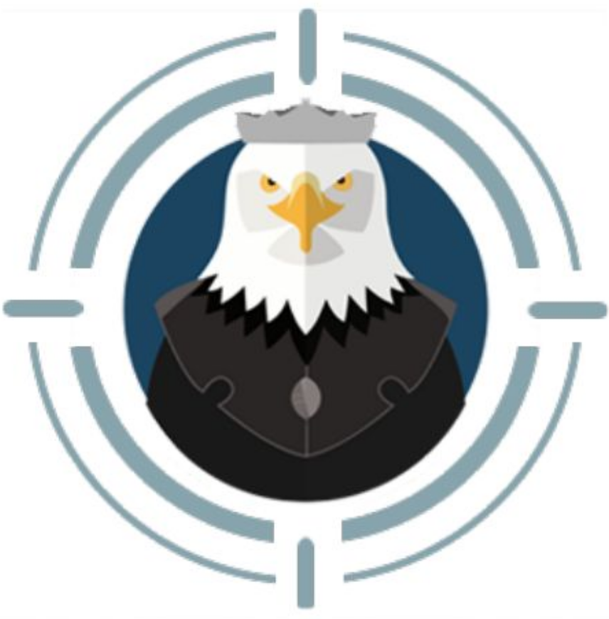
</p>


Queen AI Falcone is now in hiding. But if King Shan can find ehr
before the years are up, she will be exiled for another 15 years!

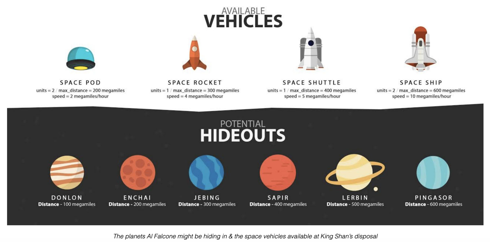

## PROBLEM 1: FINDING FALCONE
King Shan has received intelligence that AI Falcone is in hiding in one of these 6 planets - DonLon, Enchai, Jebing, Sapir,
Lerbin & Pingasor. However, he has limited resources at his disposal and can send his army to only 4 of these planets.

Your coding problem is to help King Shan find AI Falcone.

### WHAT YOU NEED TO DO
You need to build a UI (mockups available at the end of this PDF) through which King Shan can:
* Select 4 planets to search
* Select which space vehicles to send to these planets
* See how much time it will take for the vehicles to reach their targets
* Show final result of success or failure

### WHAT WE GIVE YOU
* A planets API that list out the planets, and how far they are from Lengaburu
https://5f5ff7f790cf8d00165573ed.mockapi.io/planets
* A vehicles API that lists the types of space vehicle at your disposal, how many of each
type you have, the maximum distance a vehicle can go (range), and their speed
https://5f5ff7f790cf8d00165573ed.mockapi.io/vehicles
* A FindFalcone API that returns whether you were successful in your search or not (we
randomly assign a planet to AI Falcone)
https://5f5ff7f790cf8d00165573ed.mockapi.io/find

### PLANETS API

https://5f5ff7f790cf8d00165573ed.mockapi.io/planets

**Request type:** GET
* There are 6 planets but King Shan can send vehicles to search in only 4 at a time
* All are at varying distances from Lengaburu

#### Sample Response
```
[
    {
        "name": "Donlon",
        "distance": 100
    },
    {
        "name": "Enchai",
        "distance": 200
    },
    {
        "name": "Jebing",
        "distance": 300
    },
    {
        "name": "Sapir",
        "distance": 400
    },
    {
        "name": "Lerbin",
        "distance": 500
    },
    {
        "name": "Pingasor",
        "distance": 600
    }
]
```

### VEHICLES API
https://5f5ff7f790cf8d00165573ed.mockapi.io/vehicles

**Request type:** GET

* There are 4 types of vehicles
* The units of each vehicle type vary (eg: there are 2 space pods but only 1 space rocket)
* All have different ranges (maximum distance it can travel). If the
range for a vehicle is lesser than the distance to the planet, it cannot
be chosen for going to the planet
* All have a different speed. Based on the distance to the planet and
the speed of the vehicle, time taken for the complete search should
be shown
* All are at varying distances from Lengaburu

#### Sample Response
```
[
    {
        "name": "Space pod",
        "total_no": 2,
        "max_distance": 200,
        "speed": 2
    },
    {
        "name": "Space rocket",
        "total_no": 1,
        "max_distance": 300,
        "speed": 4
    },
    {
        "name": "Space shuttle",
        "total_no": 1,
        "max_distance": 400,
        "speed": 5
    },
    {
        "name": "Space ship",
        "total_no": 2,
        "max_distance": 600,
        "speed": 10
    }
]
```

### FINDING FALCONE API (request)
1. The final result is a game of luck. We will randomly assign a planet to AI Falcone
(from the 6 available planets) and if the planet is in the list of 4 selected by the
user, you get a success message.

https://5f5ff7f790cf8d00165573ed.mockapi.io/find

**NOTE:** This is just a mock API to test your code, it will alway return the same result

**Request type:** POST

**Headers**

Accept: application/json

Content-Type: application/json

Request body: The request body is a json object which consists of a **planet_names** and **vehicle_names**.

**planet_names** is a JSON Array which consists of the planet names you selected from
the UI/ vehicle_names is also a JSON Array which consists of the vehicle names you
have selected from the UI.

#### Sample Response
```
// success
{
    "planet_name": "Jebing",
    "status": "success"
}

// failure 
{
    "status": "false"
}
```


### WHAT WE LOOK FOR IN YOUR CODE
Ready to find Falcone? Remember that it is not only about getting the UI done but how you do it that matters more. We look for
how modular your code is, how readable, extensible, how simple is the logic, do you have tests, how is your error handling,
dependency management, how do you handle navigation, templates etc.

You can use plain javascript but extra points will be given for using a client side framework such as Angular, Backbone or React.


### CHECK LIST - SUBMITTING CODE
1. Please open a Pull Request against this repository.
2. Replace this README with pertinent information.
3. Please include only source files and do not include any libraries or executables or node_modules folder.

### SAMPLE MOCKUP
As the heading suggests, this is only a sample mockup so that you have an indication of what is expected from you.
You could choose to go with a completely different user experience. But you will need to ensure:
1. All requirements mentioned in the problem are covered
2. You have a header menu bar at the top and a footer at the bottom
3. The final result should be shown on a new page and there should be navigation between at least 2 screens

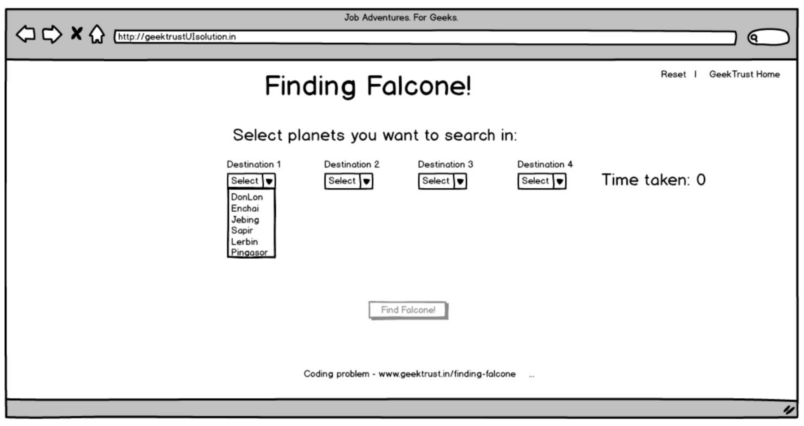


*extra points for implementing  auto-complete in the dropdown!*


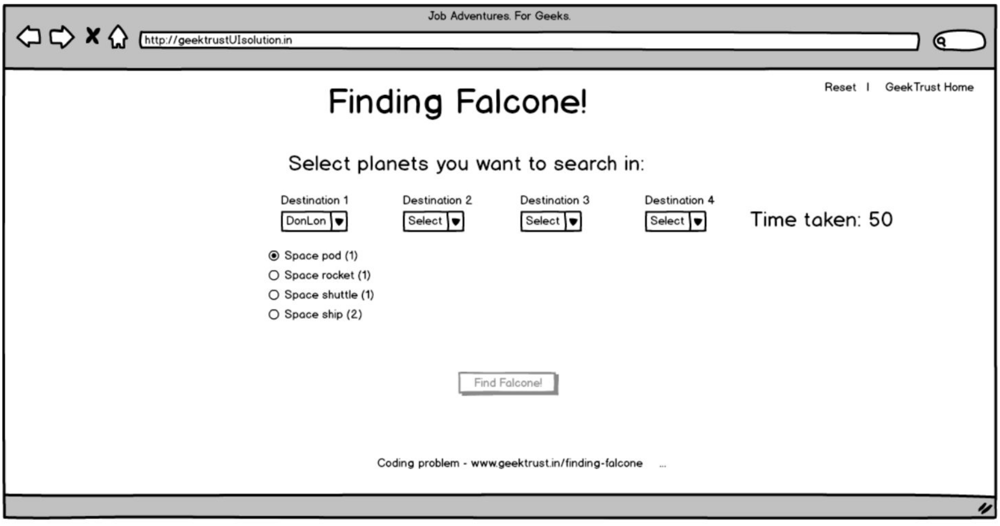


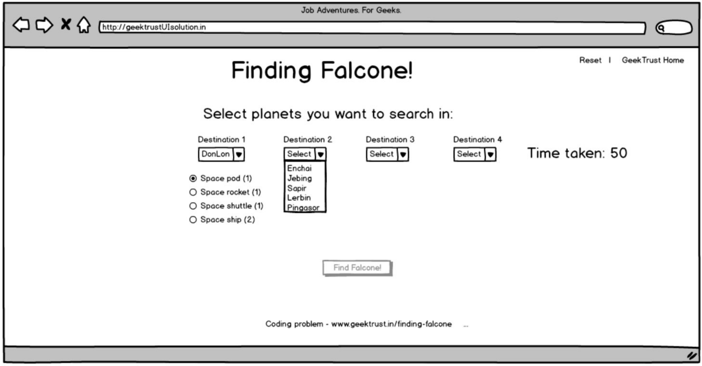


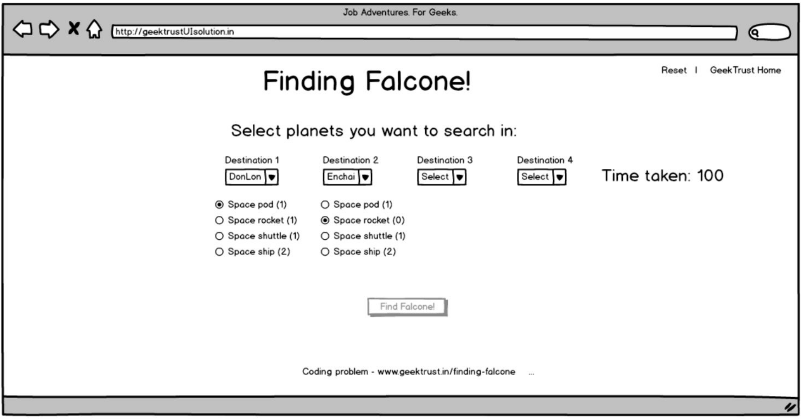


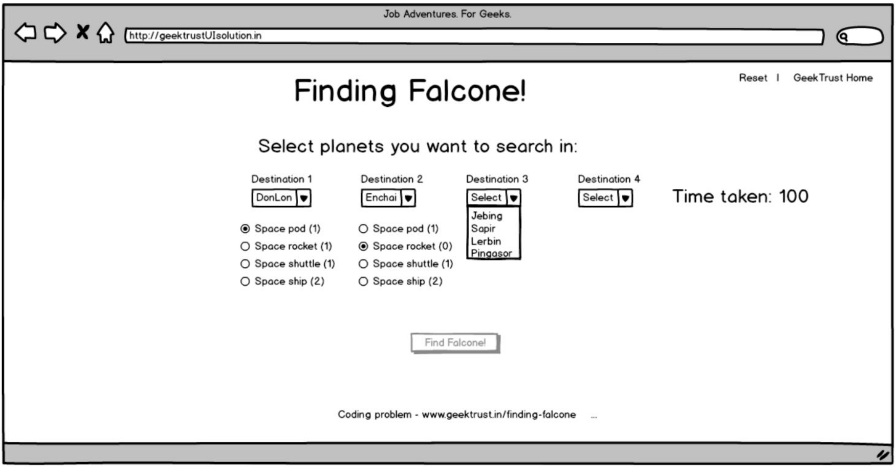


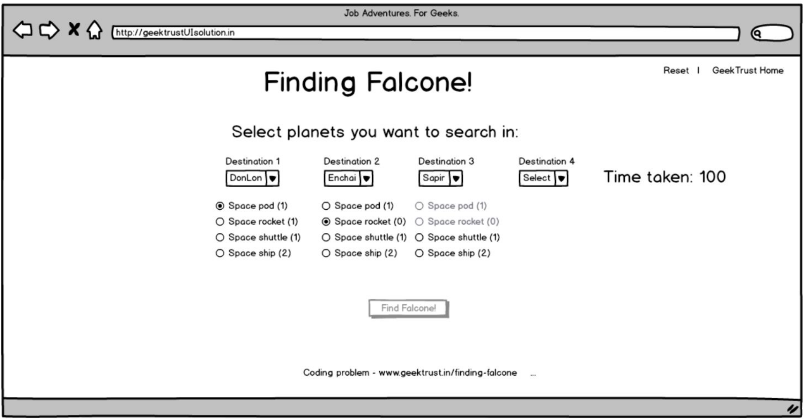


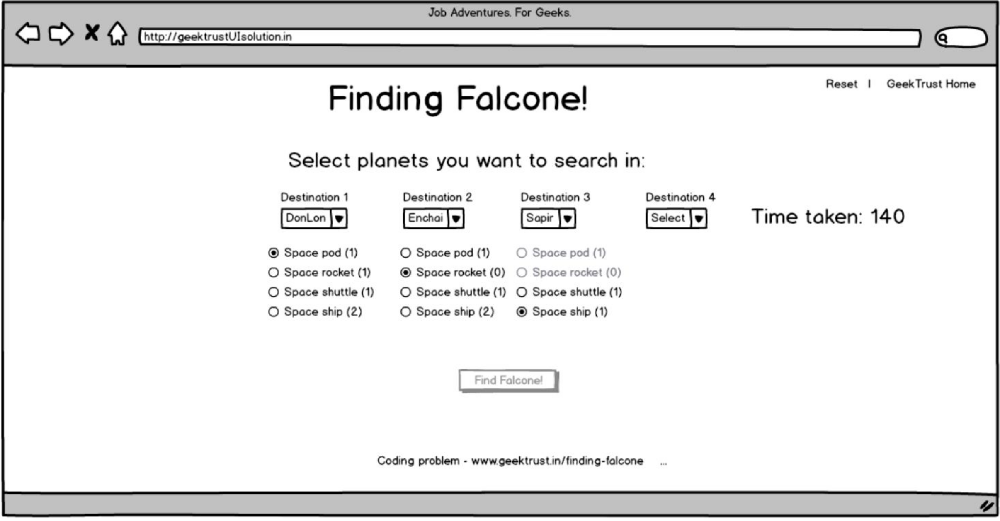


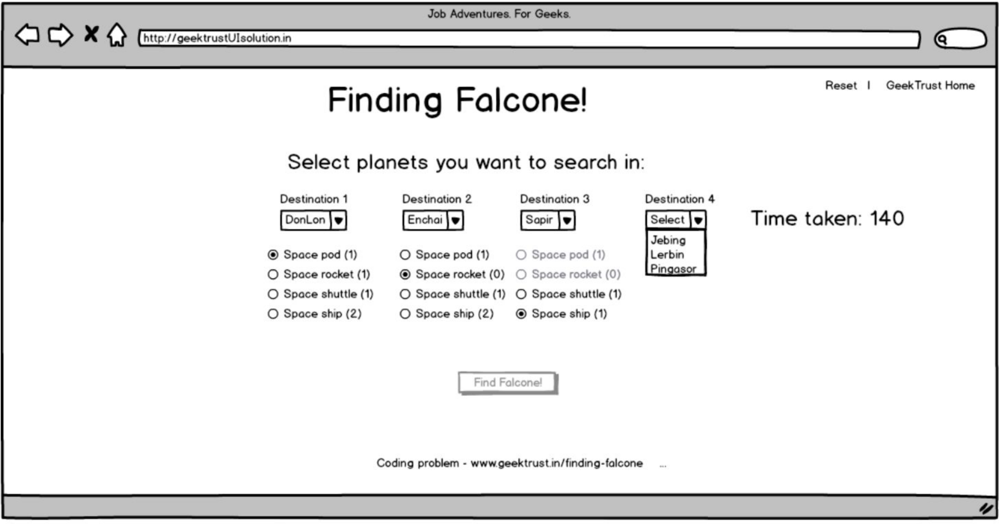


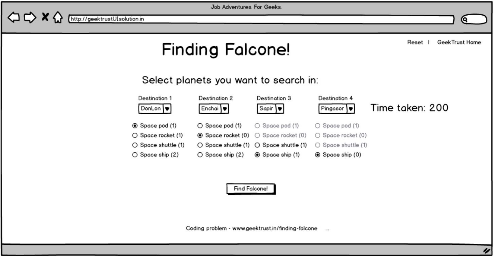


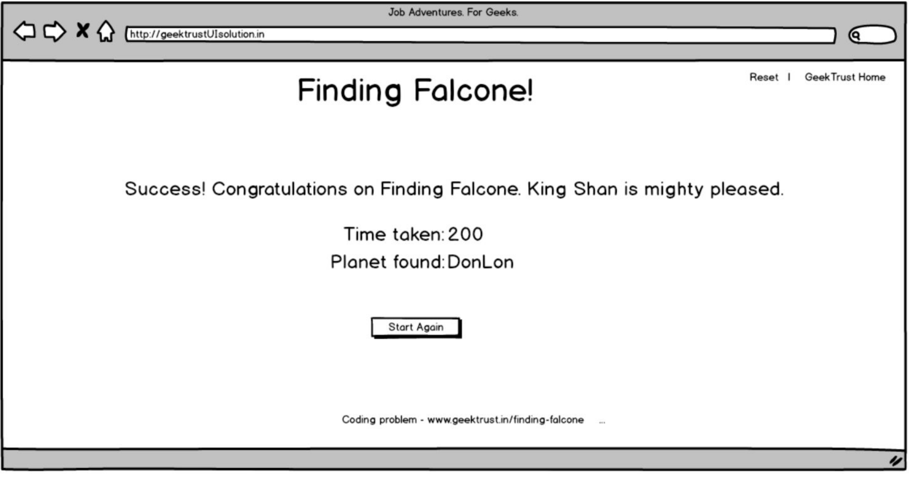


